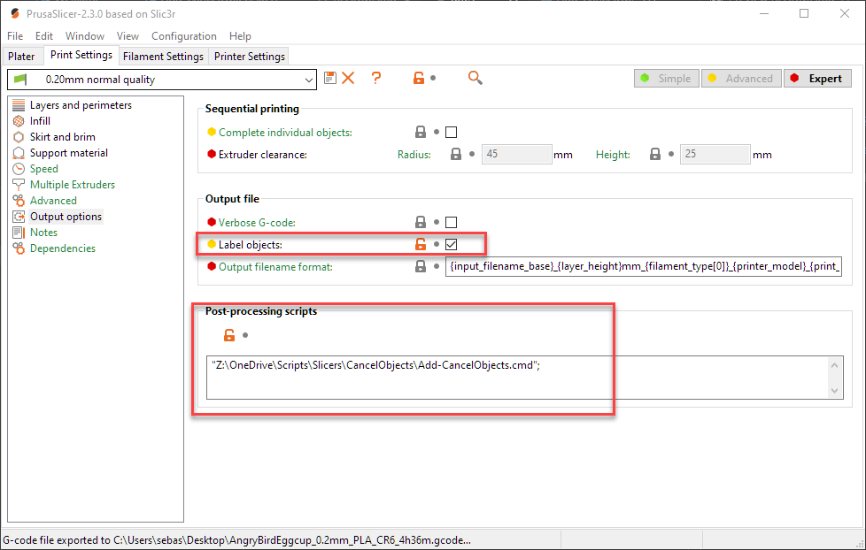

# PrusaSlicer "Cancel Objects" post processing script

Labels objects in PrusaSlicer to make it available with the [M486 gcode](https://marlinfw.org/docs/gcode/M486.html). Requires your firmware to be compiled with support for `CANCEL_OBJECTS`.

## Usage

1. Install the script and run it as a post processing script

2. Then:
 - Access it through MarlinUI
 - Or use [Octoprint Cancel Objects](https://plugins.octoprint.org/plugins/cancelobject/) plugin

## Installation

1. Download the [ZIP file](archive/refs/heads/master.zip) via the "Code -> Download ZIP" option.

2. Install [Powershell 7.1 or higher](https://docs.microsoft.com/en-us/powershell/scripting/install/installing-powershell?view=powershell-7.1#powershell)
   - On Windows 10 this is not required, but still recommended

3. Modify your profile(s) in PrusaSlicer
   - Enter the path to the post processing script in PrusaSlicer in the "Output options"
      - Windows: Enter the full path to the ".cmd" file.
      - Linux/MacOS: Enter the full path to the ".ps1" file. Ensure the file is executable.
   - Select "label objects"
   - Don't forget to click "Save"

## Troubleshooting

**Windows:** Ensure you have [unblocked the extracted files](https://www.tenforums.com/tutorials/5357-unblock-file-windows-10-a.html).

**MacOS or Linux:** Ensure that the .ps1 script is set as executable (`chmod +x`).